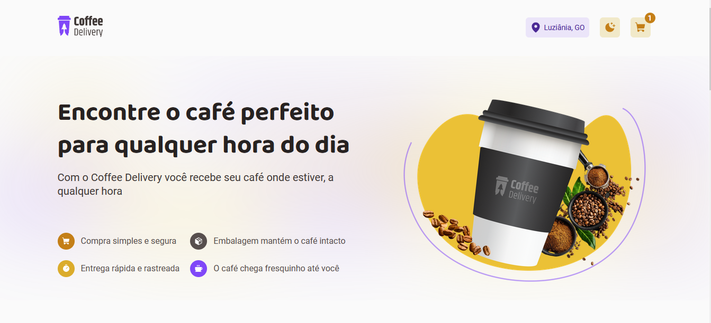

<br />

  <h1 align="center">Lidiane - Coffee Delivery :coffee: </h1>

<div align="center"></div>

<br>

> :mag_right: O Coffee Delivery é uma aplicação que imita o fluxo da compra de um produto, no qual o usuário tem um catálogo de produtos(cafés), onde adiciona quantidade de cafés de sua preferência e depois preencher o formulário de entrega e pagamento. 
> <br>

:paperclip: Link da aplicação: https://projeto-coffe-delivery-3o387xfwt-lidianediniz.vercel.app/

## :computer: Funcionalidades

- Listagem de produtos (cafés) disponíveis para compra
- Adicionar ou remover uma quantidade específicas de itens no carrinho
- Exibir o total de itens no carrinho no Header
- Exibir o valor total da soma de itens no carrinho multiplicados pelo valor

## :rocket: Tecnologias

- [Vite](https://vitejs.dev/)
- [React](https://pt-br.reactjs.org/)
- [TypeScript](https://www.typescriptlang.org/)
- [React Hook Form](https://react-hook-form.com/)
- [Styled Components](https://styled-components.com/)
- [ESLint](https://eslint.org/)

## :round_pushpin: Como Usar

<h3>Pré-requisitos</h3>

- [NodeJS](https://github.com/)
- [Git](https://github.com)
- [npm](https://www.npmjs.com/)

<h3>Clonar</h3>

```bash
git clone https://github.com/LidianeDiniz/Projeto-Coffe-Delivery.git
```

<h3>Iniciar</h3>

```bash
cd Coffe-Delivery
npm install
npm run dev
```


  </tr>
</table>
